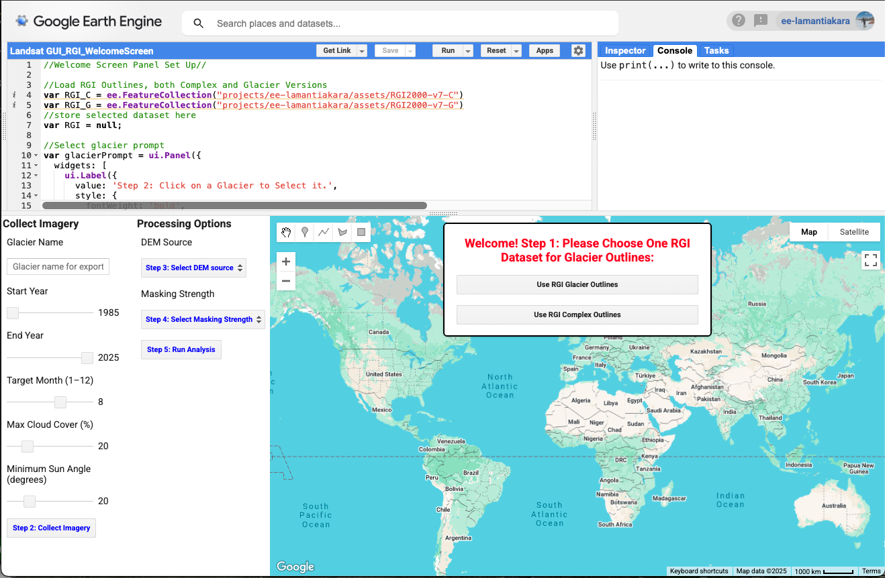

# Glacier-Snowline-Tool
**If you use this tool please cite XXXXX**

The Glacier Snowline Tool is a Google Earth Engine Tool for assessing yearly glacier health metrics (total area, snow covered area, snowline elevation, and accumulation area ratio) from Landsat imagery. More details on the tools, its structure, and validation can be found in the associated paper (XXXXX). 

## How to use the Glacier Snowline Tool

The following provides a step by walkthrough of the Glacier Snowline Tool and demonstrates its functions. If you have never used Google Earth Engine before you will need to [create a Google Earth Engine account](https://console.cloud.google.com/earth-engine/welcome) and *register for a non-commercial cloud project* before you are able to access the tool. This will include answering a few questions to ensure you qualify (all research and education purposes are covered), and you will only need to this the first time you use Google Earth Engine. Use of the Glacier Snowline tool is not permitted for commerical purposes, please contact the authors if you are a user who wants to proceed under commercial purposes. 

## Getting Started

The Glacier Snowline Tool runs through Google Earth Engine using JavaScript API. To access the tool click [here](https://code.earthengine.google.com/693c4d3f153208fbe5ea13255247e190). Once opened, a welcome page will appear as shown below, prompting the user to select either the RGI Glacier outlines or the RGI Complex Outlines. The user will need to click on their preferred dataset to load it into the tool.

##Step 1 Select a Glacier ROI

Once the preferred dataset is loaded, the user can toggle between the map or satellite layers as the basemap to zoom into their general area of interest. The Glacier Snowline Tool is set up for a 'point and click' selection where the use needs to use the mouse pointer to click within the glacier outline. The tool will then select the outline, reload only the selected outline, display it in red, set it as the ROI with a 100 meter buffer, and the console will print the RGI ID number.

